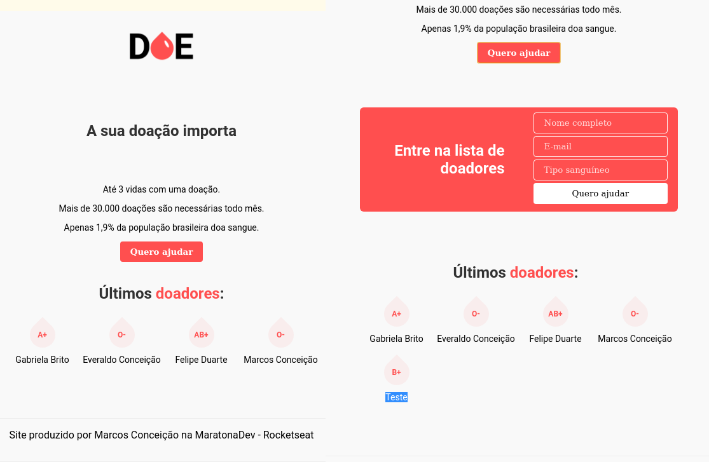

# DOE



Aplicação web voltada à inscrição de doadores de sangue. O site foi produzido na MaratonaDev da Rocketseat, em fevereiro de 2020. Visa ser uma mostra simples do potencial da união entre as ferramentas HTML, CSS e javascript.

Entre na pasta e instale os módulos necessários do `node` com:
```sh
npm install
```

## A ser feito
Próximo passo: implementação de um sistema de base de dados para persistência das inscrições.
